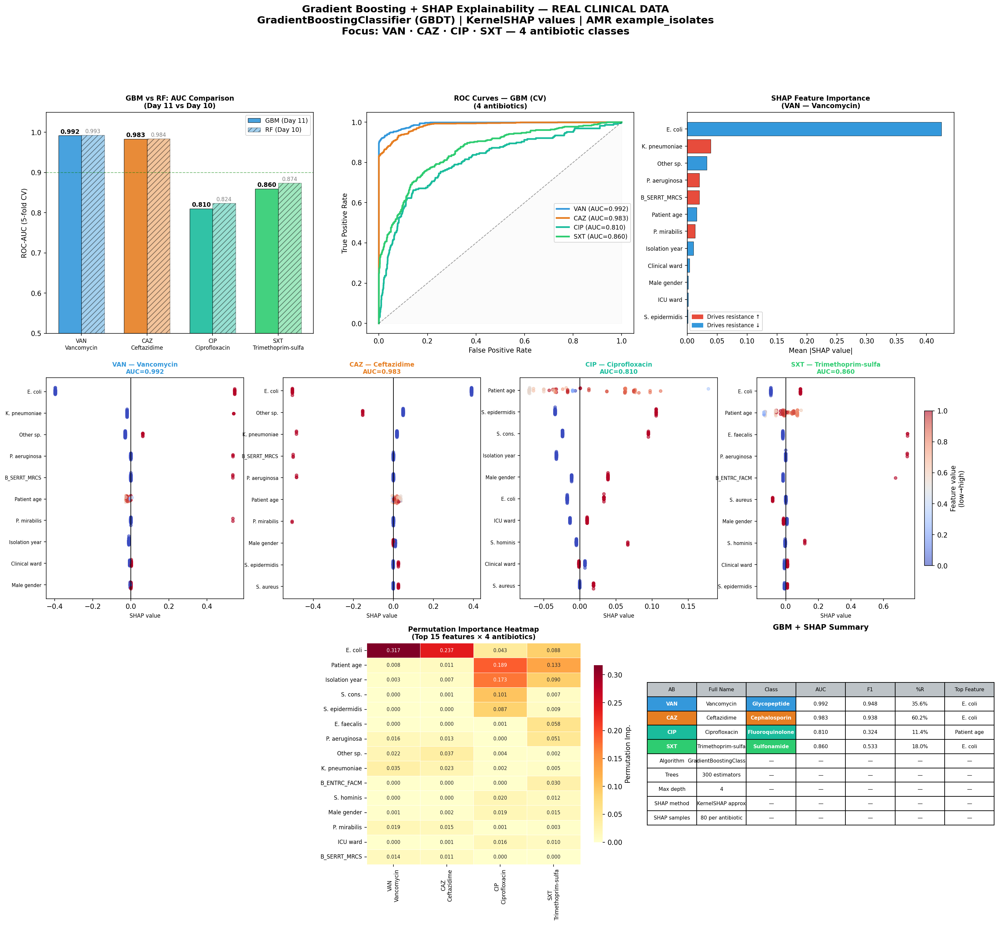

# Day 11 — Gradient Boosting + SHAP Explainability
### 🧬 30 Days of Bioinformatics | Subhadip Jana


> Gradient Boosted Decision Tree classifier with **SHAP explainability** — revealing *why* the model predicts resistance for each isolate. Focus on 4 antibiotics across 4 different classes: VAN · CAZ · CIP · SXT.

---

## 📊 Dashboard


---

## 🔬 What is SHAP?

**SHAP (SHapley Additive exPlanations)** assigns each feature a contribution value for each individual prediction:
- **Positive SHAP** → feature pushes prediction toward **Resistant**
- **Negative SHAP** → feature pushes prediction toward **Susceptible**
- Based on Shapley values from cooperative game theory

Implementation: **KernelSHAP** approximation (marginal feature contributions over background dataset)

---

## ⚙️ Model Configuration

| Parameter | Value |
|-----------|-------|
| Algorithm | GradientBoostingClassifier (GBDT — same as XGBoost) |
| Trees | 300 estimators |
| Max depth | 4 |
| Learning rate | 0.05 |
| Subsample | 0.8 (stochastic GB) |
| Class weight | balanced |
| Evaluation | 5-fold stratified CV |

---

## 📈 Model Performance (5-fold CV)

| Antibiotic | Full Name | Class | AUC | F1 | %R | Top SHAP Feature |
|------------|-----------|-------|-----|----|----|------------------|
| **VAN** | Vancomycin | Glycopeptide | **0.992** | **0.948** | 35.6% | E. coli |
| **CAZ** | Ceftazidime | Cephalosporin | **0.983** | **0.938** | 60.2% | E. coli |
| **SXT** | Trimethoprim-sulfa | Sulfonamide | 0.860 | 0.533 | 18.0% | E. coli |
| **CIP** | Ciprofloxacin | Fluoroquinolone | 0.810 | 0.324 | 11.4% | Patient age |

> ✅ VAN and CAZ achieve near-perfect AUC (>0.98) — species is overwhelmingly predictive
> 🔍 CIP uniquely driven by **patient age** — clinically meaningful (fluoroquinolone use in elderly)

---

## 🔍 Key SHAP Insights

| Antibiotic | #1 Driver | #2 Driver | #3 Driver | Clinical Interpretation |
|------------|-----------|-----------|-----------|------------------------|
| VAN | E. coli | K. pneumoniae | Other sp. | Gram-negatives → intrinsically VAN resistant |
| CAZ | E. coli | Other sp. | K. pneumoniae | Gram-negative cephalosporin resistance |
| CIP | Patient age | S. epidermidis | S. cons. | Elderly = more prior fluoroquinolone exposure |
| SXT | E. coli | Patient age | E. faecalis | E. coli SXT resistance a known clinical challenge |

---

## 🤖 Saved Models

| File | Size | Description |
|------|------|-------------|
| `gbm_models.pkl` | ~5 MB | Dict of 4 trained GBM models (one per antibiotic) |
| `gbm_metadata.pkl` | ~1 KB | Feature names, species list, normalization params |

---

## ⚡ Quick Inference with `predict.py`

```bash
python predict.py
```

```python
from predict import predict_resistance

result = predict_resistance(
    species = "B_ESCHR_COLI",
    ward    = "ICU",
    age     = 75,
    gender  = "M",
    year    = 2024
)

print(result["resistant_to"])           # ['Vancomycin', 'Ceftazidime', ...]
print(result["per_antibiotic"]["VAN"])  # {'probability': 0.986, 'prediction': 'R', ...}
```

---

## 📊 SHAP Output Files

| File | Description |
|------|-------------|
| `shap_values_VAN.csv` | 80 × 22 SHAP matrix for Vancomycin |
| `shap_values_CAZ.csv` | 80 × 22 SHAP matrix for Ceftazidime |
| `shap_values_CIP.csv` | 80 × 22 SHAP matrix for Ciprofloxacin |
| `shap_values_SXT.csv` | 80 × 22 SHAP matrix for Trimethoprim-sulfa |

---

## 🚀 How to Retrain from Scratch

```bash
pip install pandas numpy matplotlib seaborn scikit-learn
python xgboost_shap.py
```

---

## 📁 Complete Project Structure

```
day11-xgboost-shap/
├── xgboost_shap.py                  ← full training + SHAP script
├── predict.py                       ← inference script
├── README.md
├── data/
│   └── isolates.csv                 ← 2,000 clinical isolates
└── outputs/
    ├── gbm_models.pkl               ← 🤖 4 trained GBM models
    ├── gbm_metadata.pkl             ← 📋 feature + normalization info
    ├── predict.py                   ← ⚡ inference script (copy)
    ├── shap_values_VAN.csv          ← 🔍 SHAP values — Vancomycin
    ├── shap_values_CAZ.csv          ← 🔍 SHAP values — Ceftazidime
    ├── shap_values_CIP.csv          ← 🔍 SHAP values — Ciprofloxacin
    ├── shap_values_SXT.csv          ← 🔍 SHAP values — Trimethoprim-sulfa
    └── xgboost_shap_dashboard.png  ← 📈 9-panel visualization
```

---

## 🔗 Part of #30DaysOfBioinformatics
**Author:** Subhadip Jana | [GitHub](https://github.com/SubhadipJana1409) | [LinkedIn](https://linkedin.com/in/subhadip-jana1409)
